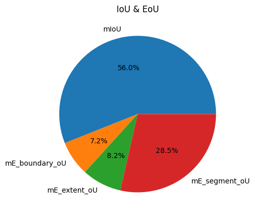
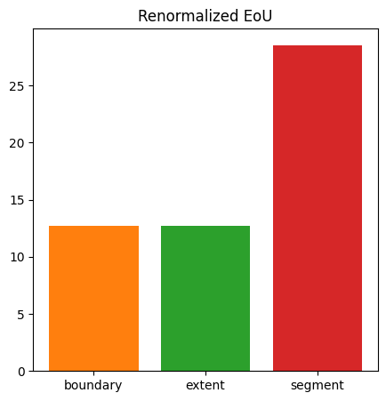
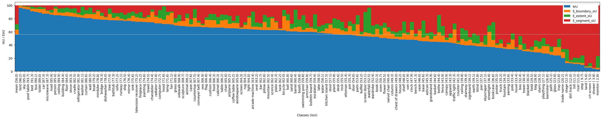

# Evaluation Report

## Overall Metrics

|      Metric                   | Score (%) |
|:------------------------------|----------:|
| mIoU                          |    56.0   |
| mE_boundary_oU ↓              |     7.2   |
| ├── mFP_boundary_oU ↓         |     3.0   |
| ├── mFN_boundary_oU ↓         |     4.2   |
| └── mE_boundary_oU_renormed ↓ |    12.7   |
| mE_extent_oU ↓                |     8.2   |
| ├── mFP_extent_oU ↓           |     2.8   |
| ├── mFN_extent_oU ↓           |     5.4   |
| └── mE_extent_oU_renormed ↓   |    12.7   |
| mE_segment_oU ↓               |    28.5   |
| ├── mFP_segment_oU ↓          |    15.6   |
| ├── mFN_segment_oU ↓          |    13.0   |
| └── mE_segment_oU_renormed ↓  |    28.5   |
| mPrecision                    |    70.6   |
| mRecall                       |    69.4   |
| mF1_score                     |    69.2   |
| PixelAcc                      |    85.2   |
| mBoundaryIoU                  |    41.3   |
| mTrimapIoU                    |    61.4   |

## Error over Union

## Renormalized Error over Union

## Classwise Analysis

